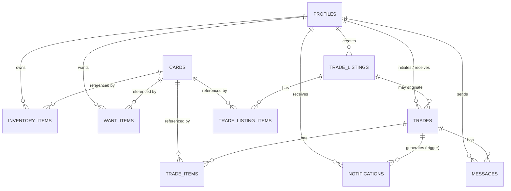

# Database Schema

Full SQL lives in `supabase/migrations/`, applied in order:

1. `0001_init_schema.sql` — tables, constraints, indexes, triggers
2. `0002_rls_policies.sql` — Row Level Security policies
3. `0003_fairness_config_seed.sql` — seeds the default fairness config
4. `0004_realtime_publication.sql` — adds `messages` to `supabase_realtime`
5. `0005_cards_composite_indexes.sql` — composite `(rarity, ovr_rating desc, id)` /
   `(team, ovr_rating desc, id)` indexes for the `/cards` "Load more" query shape
6. `0006_cards_filter_facets.sql` — `position`/`set_name` indexes (single-column and
   composite, same pattern as 0005) plus `cards_distinct_teams()` /
   `cards_distinct_set_names()` RPC functions backing the filter panel's Team/Set dropdowns
7. `0007_admin_role.sql` — adds `profiles.role` and admin-only read policies on
   `inventory_items`/`want_items`/`trades`/`trade_items` for the admin user list/activity view
8. `0008_inventory_custom_images.sql` — adds `inventory_items.custom_image_url` plus the public
   `card-images` storage bucket + owner-scoped storage policies backing it
9. `0009_user_discovery_and_notifications.sql` — adds a public `select` policy on
   `inventory_items` (user discovery — see below), the `notifications` table, its RLS policies, and
   the `notify_trade_event()` trigger that populates it
10. `0010_want_items_public_read.sql` — adds a public `select` policy on `want_items`, same
    additive technique as `0009`'s `inventory_items` policy, so a trader's profile can show what
    they're looking for alongside their Haves

All tables live in the `public` schema. `auth.users` is Supabase-managed.

## Entity relationship overview

## Tables

### `profiles`
1:1 with `auth.users`; auto-created by the `handle_new_user()` trigger on signup.

| Column | Type | Notes |
|---|---|---|
| `id` | `uuid` PK | `references auth.users(id) on delete cascade` |
| `username` | `text` | unique, not null |
| `display_name` | `text` | nullable |
| `avatar_url` | `text` | nullable |
| `role` | `text` | check: `user, admin`; default `'user'` — promoted by hand via SQL, no self-serve UI |
| `created_at` / `updated_at` | `timestamptz` | default `now()` |

### `cards`
Canonical card catalog — public read, service-role write only.

| Column | Type | Notes |
|---|---|---|
| `id` | `uuid` PK | |
| `external_ref` | `text` | source-system id, nullable |
| `source` | `text` | e.g. `manual`, `csv`, `cheerio:example`; unique with `external_ref` |
| `name` | `text` | not null |
| `team` | `text` | nullable |
| `position` | `text` | nullable |
| `rarity` | `text` | check: `common, uncommon, rare, super_rare, legend, limited, other` |
| `ovr_rating` | `smallint` | check 0–99 |
| `base_price` | `numeric(10,2)` | check ≥ 0; feeds the fairness engine |
| `image_url` | `text` | nullable |
| `set_name`, `season` | `text` | nullable |
| `attributes` | `jsonb` | flexible bag for extra stat breakdowns |
| `created_at` / `updated_at` | `timestamptz` | |

Indexes: `gin (name gin_trgm_ops)` (supports `ilike` search); btree on `rarity`, `ovr_rating`,
`team`, `position`, `set_name`; composite `(facet, ovr_rating desc, id)` on each of
`rarity`/`team`/`position`/`set_name` for the `/cards` filtered-and-sorted "Load more" query shape.
Requires the `pg_trgm` extension (enabled in the migration).

RPC functions: `cards_distinct_teams()`, `cards_distinct_set_names()` — return the distinct
non-null values of those free-text columns, used to populate the `/cards` filter panel's Team and
Set dropdowns (`postgrest-js` has no `DISTINCT` support in its query builder).

### `inventory_items` ("Haves")
| Column | Type | Notes |
|---|---|---|
| `id` | `uuid` PK | |
| `user_id` | `uuid` | → `profiles(id)` |
| `card_id` | `uuid` | → `cards(id)` |
| `quantity` | `integer` | default 1, ≥ 0 |
| `condition` | `text` | default `'good'` |
| `notes` | `text` | nullable |
| `custom_image_url` | `text` | nullable — a user's own photo of their physical card, in the `card-images` storage bucket, overriding the catalog's stock `cards.image_url` wherever this row's image is shown |

Unique on `(user_id, card_id)` — adding an owned duplicate upserts quantity rather than duplicating rows.

### `want_items` ("Wants")
| Column | Type | Notes |
|---|---|---|
| `id` | `uuid` PK | |
| `user_id` | `uuid` | → `profiles(id)` |
| `card_id` | `uuid` | → `cards(id)` |
| `priority` | `smallint` | default 0 |

Unique on `(user_id, card_id)`.

### `trade_listings`
Public "I have X, I want Y" advertisement.

| Column | Type | Notes |
|---|---|---|
| `id` | `uuid` PK | |
| `owner_id` | `uuid` | → `profiles(id)` |
| `title` | `text` | nullable |
| `status` | `text` | check: `open, pending, completed, cancelled` |
| `fairness_score` | `numeric(5,2)` | cached, nullable |

### `trade_listing_items`
Line items for a listing, tagged `have` or `want`.

| Column | Type | Notes |
|---|---|---|
| `id` | `uuid` PK | |
| `listing_id` | `uuid` | → `trade_listings(id)` |
| `card_id` | `uuid` | → `cards(id)` |
| `side` | `text` | check: `have, want` |
| `quantity` | `integer` | > 0 |

### `trades`
A concrete negotiation between two users — distinct from `trade_listings` so a negotiation can
diverge from the original listing's terms.

| Column | Type | Notes |
|---|---|---|
| `id` | `uuid` PK | |
| `listing_id` | `uuid` | → `trade_listings(id)`, nullable (`on delete set null`) |
| `initiator_id` | `uuid` | → `profiles(id)` |
| `counterparty_id` | `uuid` | → `profiles(id)` |
| `status` | `text` | check: `proposed, accepted, rejected, completed, cancelled` |
| `fairness_score` | `numeric(5,2)` | nullable until computed |
| `fairness_breakdown` | `jsonb` | full `FairnessResult` snapshot, for auditability |

Check constraint: `initiator_id <> counterparty_id`.

### `trade_items`
Concrete cards each party contributes to a specific trade (distinct from `trade_listing_items`).

| Column | Type | Notes |
|---|---|---|
| `id` | `uuid` PK | |
| `trade_id` | `uuid` | → `trades(id)` |
| `offered_by` | `uuid` | → `profiles(id)` — which party contributes this item |
| `card_id` | `uuid` | → `cards(id)` |
| `quantity` | `integer` | > 0 |

### `messages`
Chat tied to a trade; channel-per-trade Realtime pattern (see [SYSTEM_ARCHITECTURE.md](./SYSTEM_ARCHITECTURE.md)).

| Column | Type | Notes |
|---|---|---|
| `id` | `uuid` PK | |
| `trade_id` | `uuid` | → `trades(id)` |
| `sender_id` | `uuid` | → `profiles(id)` |
| `body` | `text` | ≤ 2000 chars |
| `created_at` | `timestamptz` | indexed with `trade_id` |

### `notifications`
Recipient's inbox row for a trade lifecycle event. Rows are only ever created by the
`notify_trade_event()` trigger on `trades` (see below) — there is intentionally no client insert
path.

| Column | Type | Notes |
|---|---|---|
| `id` | `uuid` PK | |
| `user_id` | `uuid` | → `profiles(id)` — the recipient |
| `actor_id` | `uuid` | → `profiles(id)`, nullable — who caused the event |
| `type` | `text` | check: `trade_proposed, trade_accepted, trade_rejected, trade_completed, trade_cancelled` |
| `trade_id` | `uuid` | → `trades(id)` on delete cascade |
| `read_at` | `timestamptz` | nullable — unread until set |
| `created_at` | `timestamptz` | default `now()` |

Indexes: `(user_id, created_at desc)` for the inbox list; partial `(user_id) where read_at is null`
for the unread-count query. Added to the `supabase_realtime` publication so the notification bell
updates live (same technique as `messages` in `0004_realtime_publication.sql`).

`notify_trade_event()` (`security definer`, mirrors `handle_new_user()`'s pattern in
`0001_init_schema.sql`) fires `after insert on trades` (creates a `trade_proposed` row for the
counterparty) and `after update of status on trades` (creates a `trade_<status>` row for whichever
party didn't make the change, inferred from `auth.uid()` inside the trigger).

### `fairness_rules` (TradeFairnessRules)
Table-driven weights so the fairness heuristic is tunable without a code deploy.

| Column | Type | Notes |
|---|---|---|
| `id` | `uuid` PK | |
| `key` | `text` | unique, e.g. `'default'` |
| `rarity_weights` | `jsonb` | `{"common":1,"uncommon":1.2,"rare":1.5,"super_rare":2,"legend":3,"limited":4,"other":1}` |
| `ovr_weight` | `numeric` | default 0.5 |
| `price_weight` | `numeric` | default 1.0 |
| `tolerance_pct` | `numeric` | default 10.0 — % delta still considered "fair" |
| `is_active` | `boolean` | default true |

Seeded with a `key='default'` row in `0003_fairness_config_seed.sql` so the fairness function
always has a config to read.

## Row Level Security

Every table has RLS enabled. Summary (full policies in `0002_rls_policies.sql`):

| Table | Policy |
|---|---|
| `profiles` | select: public; insert/update: `auth.uid() = id` only |
| `cards` | select: public; writes: service-role only (no client policy — bypassed by the seeder's service key) |
| `inventory_items` | full CRUD only where `auth.uid() = user_id`; **plus** select for admins (`profiles.role = 'admin'`); **plus** select: public (`0009`, for the Traders discovery view — writes are still owner-only) |
| `want_items` | full CRUD only where `auth.uid() = user_id`; **plus** select for admins; **plus** select: public (`0010`, shown on a trader's public profile — writes are still owner-only) |
| `trade_listings` | select: public; insert/update/delete: owner only |
| `trade_listing_items` | select: public; insert/update/delete: only if the parent listing's `owner_id = auth.uid()` |
| `trades` | select/update: `auth.uid() in (initiator_id, counterparty_id)`; insert: `auth.uid() = initiator_id`; **plus** select for admins |
| `trade_items` | select: participants of parent trade; insert/delete: the participant whose `offered_by = auth.uid()`; **plus** select for admins |
| `messages` | select/insert: `auth.uid() in (initiator_id, counterparty_id)` of the parent trade — the core privacy gate for chat; deliberately **not** given an admin bypass, so trade chat stays private |
| `fairness_rules` | select: public; write: service-role only |
| `notifications` | select/update: `auth.uid() = user_id` (update is how a row gets marked read); **no insert/delete policy** — rows are only created by the `notify_trade_event()` trigger |

The admin bypass policies (`0007_admin_role.sql`) are read-only and additive — they grant an
extra `select` path alongside the existing owner/participant policies rather than replacing them,
and check the caller's own `profiles.role` via `exists (select 1 from public.profiles p where
p.id = auth.uid() and p.role = 'admin')`, the same cross-table pattern already used by the
`trade_items`/`trade_listing_items`/`messages` policies above.

Policies that join through a second table (`trade_listing_items` → `trade_listings`, `trade_items`/`messages` → `trades`)
were each verified with a manual two-user test rather than trusted on "no error" alone.

## Storage

| Bucket | Public | Notes |
|---|---|---|
| `card-images` | yes (read) | User-uploaded photos of physical cards, referenced by `inventory_items.custom_image_url`. Object path convention: `{auth.uid()}/{card_id}-{timestamp}.{ext}`. `storage.objects` policies (`0008_inventory_custom_images.sql`) restrict insert/update/delete to the path's own `{auth.uid()}` folder (`(storage.foldername(name))[1] = auth.uid()::text`); select is public since the bucket itself is public and these are just card photos. |
