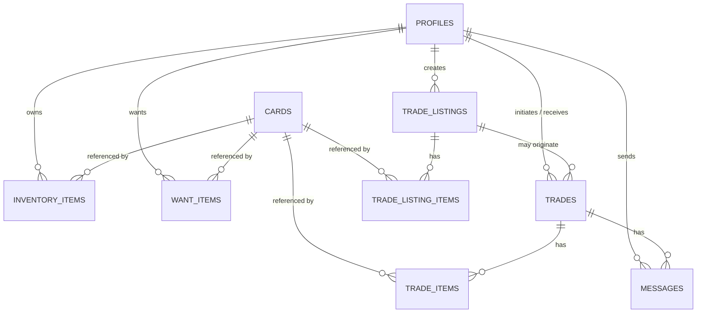

# Database Schema

Full SQL lives in `supabase/migrations/`, applied in order:

1. `0001_init_schema.sql` — tables, constraints, indexes, triggers
2. `0002_rls_policies.sql` — Row Level Security policies
3. `0003_fairness_config_seed.sql` — seeds the default fairness config
4. `0004_realtime_publication.sql` — adds `messages` to `supabase_realtime`

All tables live in the `public` schema. `auth.users` is Supabase-managed.

## Entity relationship overview

## Tables

### `profiles`
1:1 with `auth.users`; auto-created by the `handle_new_user()` trigger on signup.

| Column | Type | Notes |
|---|---|---|
| `id` | `uuid` PK | `references auth.users(id) on delete cascade` |
| `username` | `text` | unique, not null |
| `display_name` | `text` | nullable |
| `avatar_url` | `text` | nullable |
| `created_at` / `updated_at` | `timestamptz` | default `now()` |

### `cards`
Canonical card catalog — public read, service-role write only.

| Column | Type | Notes |
|---|---|---|
| `id` | `uuid` PK | |
| `external_ref` | `text` | source-system id, nullable |
| `source` | `text` | e.g. `manual`, `csv`, `cheerio:example`; unique with `external_ref` |
| `name` | `text` | not null |
| `team` | `text` | nullable |
| `position` | `text` | nullable |
| `rarity` | `text` | check: `common, uncommon, rare, super_rare, legend, limited, other` |
| `ovr_rating` | `smallint` | check 0–99 |
| `base_price` | `numeric(10,2)` | check ≥ 0; feeds the fairness engine |
| `image_url` | `text` | nullable |
| `set_name`, `season` | `text` | nullable |
| `attributes` | `jsonb` | flexible bag for extra stat breakdowns |
| `created_at` / `updated_at` | `timestamptz` | |

Indexes: `gin (name gin_trgm_ops)` (supports `ilike` search), plus btree on `rarity`, `ovr_rating`, `team`.
Requires the `pg_trgm` extension (enabled in the migration).

### `inventory_items` ("Haves")
| Column | Type | Notes |
|---|---|---|
| `id` | `uuid` PK | |
| `user_id` | `uuid` | → `profiles(id)` |
| `card_id` | `uuid` | → `cards(id)` |
| `quantity` | `integer` | default 1, ≥ 0 |
| `condition` | `text` | default `'good'` |
| `notes` | `text` | nullable |

Unique on `(user_id, card_id)` — adding an owned duplicate upserts quantity rather than duplicating rows.

### `want_items` ("Wants")
| Column | Type | Notes |
|---|---|---|
| `id` | `uuid` PK | |
| `user_id` | `uuid` | → `profiles(id)` |
| `card_id` | `uuid` | → `cards(id)` |
| `priority` | `smallint` | default 0 |

Unique on `(user_id, card_id)`.

### `trade_listings`
Public "I have X, I want Y" advertisement.

| Column | Type | Notes |
|---|---|---|
| `id` | `uuid` PK | |
| `owner_id` | `uuid` | → `profiles(id)` |
| `title` | `text` | nullable |
| `status` | `text` | check: `open, pending, completed, cancelled` |
| `fairness_score` | `numeric(5,2)` | cached, nullable |

### `trade_listing_items`
Line items for a listing, tagged `have` or `want`.

| Column | Type | Notes |
|---|---|---|
| `id` | `uuid` PK | |
| `listing_id` | `uuid` | → `trade_listings(id)` |
| `card_id` | `uuid` | → `cards(id)` |
| `side` | `text` | check: `have, want` |
| `quantity` | `integer` | > 0 |

### `trades`
A concrete negotiation between two users — distinct from `trade_listings` so a negotiation can
diverge from the original listing's terms.

| Column | Type | Notes |
|---|---|---|
| `id` | `uuid` PK | |
| `listing_id` | `uuid` | → `trade_listings(id)`, nullable (`on delete set null`) |
| `initiator_id` | `uuid` | → `profiles(id)` |
| `counterparty_id` | `uuid` | → `profiles(id)` |
| `status` | `text` | check: `proposed, accepted, rejected, completed, cancelled` |
| `fairness_score` | `numeric(5,2)` | nullable until computed |
| `fairness_breakdown` | `jsonb` | full `FairnessResult` snapshot, for auditability |

Check constraint: `initiator_id <> counterparty_id`.

### `trade_items`
Concrete cards each party contributes to a specific trade (distinct from `trade_listing_items`).

| Column | Type | Notes |
|---|---|---|
| `id` | `uuid` PK | |
| `trade_id` | `uuid` | → `trades(id)` |
| `offered_by` | `uuid` | → `profiles(id)` — which party contributes this item |
| `card_id` | `uuid` | → `cards(id)` |
| `quantity` | `integer` | > 0 |

### `messages`
Chat tied to a trade; channel-per-trade Realtime pattern (see [SYSTEM_ARCHITECTURE.md](./SYSTEM_ARCHITECTURE.md)).

| Column | Type | Notes |
|---|---|---|
| `id` | `uuid` PK | |
| `trade_id` | `uuid` | → `trades(id)` |
| `sender_id` | `uuid` | → `profiles(id)` |
| `body` | `text` | ≤ 2000 chars |
| `created_at` | `timestamptz` | indexed with `trade_id` |

### `fairness_rules` (TradeFairnessRules)
Table-driven weights so the fairness heuristic is tunable without a code deploy.

| Column | Type | Notes |
|---|---|---|
| `id` | `uuid` PK | |
| `key` | `text` | unique, e.g. `'default'` |
| `rarity_weights` | `jsonb` | `{"common":1,"uncommon":1.2,"rare":1.5,"super_rare":2,"legend":3,"limited":4,"other":1}` |
| `ovr_weight` | `numeric` | default 0.5 |
| `price_weight` | `numeric` | default 1.0 |
| `tolerance_pct` | `numeric` | default 10.0 — % delta still considered "fair" |
| `is_active` | `boolean` | default true |

Seeded with a `key='default'` row in `0003_fairness_config_seed.sql` so the fairness function
always has a config to read.

## Row Level Security

Every table has RLS enabled. Summary (full policies in `0002_rls_policies.sql`):

| Table | Policy |
|---|---|
| `profiles` | select: public; insert/update: `auth.uid() = id` only |
| `cards` | select: public; writes: service-role only (no client policy — bypassed by the seeder's service key) |
| `inventory_items` | full CRUD only where `auth.uid() = user_id` |
| `want_items` | full CRUD only where `auth.uid() = user_id` |
| `trade_listings` | select: public; insert/update/delete: owner only |
| `trade_listing_items` | select: public; insert/update/delete: only if the parent listing's `owner_id = auth.uid()` |
| `trades` | select/update: `auth.uid() in (initiator_id, counterparty_id)`; insert: `auth.uid() = initiator_id` |
| `trade_items` | select: participants of parent trade; insert/delete: the participant whose `offered_by = auth.uid()` |
| `messages` | select/insert: `auth.uid() in (initiator_id, counterparty_id)` of the parent trade — the core privacy gate for chat |
| `fairness_rules` | select: public; write: service-role only |

Policies that join through a second table (`trade_listing_items` → `trade_listings`, `trade_items`/`messages` → `trades`)
were each verified with a manual two-user test rather than trusted on "no error" alone.
