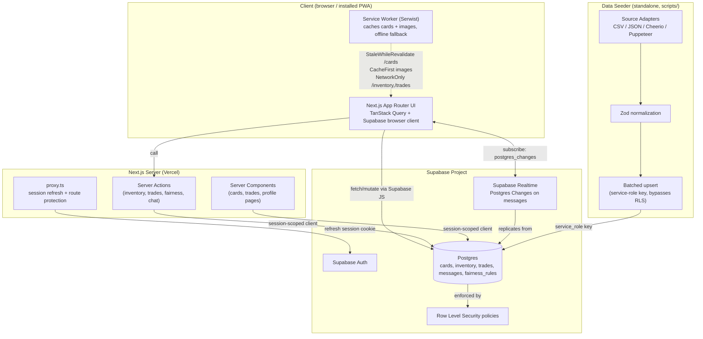

# System Architecture

## Overview

Bitts Attax is a Next.js App Router application backed entirely by Supabase (Postgres, Auth,
Realtime). There is no separate backend service — Server Actions running inside the Next.js server
process are the only write path, and they always go through a session-scoped Supabase client so
Row Level Security (RLS) is enforced even if an action has a bug. The one process that runs outside
the Next.js app is the data ingestion script, which seeds/updates the `cards` catalog using the
Supabase service-role key.

## Components

### Frontend / PWA (`app/`, `components/`, `lib/queries/`, `lib/realtime/`)
- Next.js App Router with two route groups: `(auth)` (login/signup/magic-link, unauthenticated) and
  `(main)` (cards/inventory/trades/profile, authenticated — enforced by `proxy.ts`).
- TanStack Query owns client-side data fetching/caching; Supabase's browser client
  (`lib/supabase/client.ts`) is the fetch layer underneath it.
- Serwist (`app/sw.ts`, wired via `next.config.ts`) precaches the app shell and applies
  runtime caching rules for offline card browsing — see [PWA_STRATEGY.md](./PWA_STRATEGY.md).

### Server (Server Actions + Server Components)
- Server Components (`lib/supabase/server.ts`) read data at request time using the visitor's own
  session, so RLS applies identically to server-rendered and client-fetched data.
- Server Actions (`app/(main)/inventory/actions.ts`, `app/(main)/trades/actions.ts`,
  `app/(main)/trades/[tradeId]/fairness-actions.ts`, `app/(main)/trades/[tradeId]/chat/actions.ts`)
  are the only write path — see [API_SPECIFICATION.md](./API_SPECIFICATION.md).
- `proxy.ts` (Next 16's renamed `middleware.ts`) refreshes the Supabase session cookie on every
  request and redirects unauthenticated visitors away from protected routes.

### Database (Supabase Postgres)
- Schema, relationships, and RLS policies are defined in `supabase/migrations/` — see
  [DATABASE_SCHEMA.md](./DATABASE_SCHEMA.md).
- `fairness_rules` is a table-driven config (not hardcoded weights) read by
  `lib/fairness.ts`/`fairness-actions.ts` so the trade-fairness heuristic can be tuned without a
  code deploy.

### Supabase Realtime (chat)
- Channel-per-trade pattern: `lib/realtime/useTradeChannel.ts` subscribes to Postgres Changes on
  `messages` filtered by `trade_id`, pushing new rows directly into the TanStack Query cache.
  `messages` is added to the `supabase_realtime` publication in
  `0004_realtime_publication.sql`; RLS still governs what a subscribed client actually receives.

### Data Seeder (`scripts/`)
- A standalone Node process (run via `tsx`, never imported by the Next.js app) because Puppeteer
  needs a full Chromium binary that cannot run inside a Vercel serverless function.
- Adapter pattern (`scripts/ingest/adapter.ts`) lets CSV, JSON, and (future) scraped sources share
  one Zod-based normalization pipeline before a batched upsert using the service-role key — see
  [DATA_INGESTION_STRATEGY.md](./DATA_INGESTION_STRATEGY.md).

## Request flow: proposing a trade

1. User browses open listings on `/trades` (`TradeBrowseList` → `useTradeListings`).
2. Clicking "Propose Trade" calls the `proposeTrade` Server Action, which inserts a `trades` row and
   the corresponding `trade_items` for both parties.
3. The trade detail page (`/trades/[tradeId]`) calls `computeAndPersistFairness`, which loads the
   trade's items, the active `fairness_rules` row, runs the pure `computeFairnessScore` function,
   and persists the result onto `trades.fairness_score` / `fairness_breakdown`.
4. Either party opens `/trades/[tradeId]/chat` to negotiate over Realtime chat while the trade sits
   in `proposed` status; the counterparty accepts or rejects via `updateTradeStatus`.
